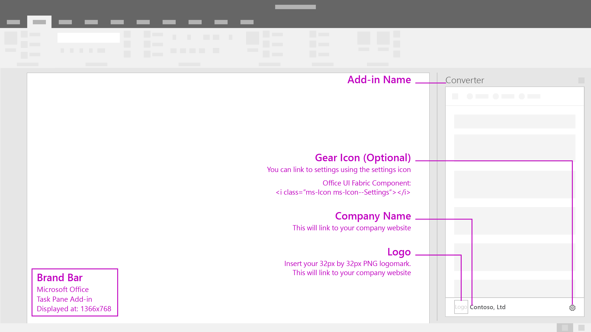

# Brand Bar

The brand bar is a space in the footer to include your brand name and logo. It also serves as a link to your brand's website and an optional settings access location.

#### Code sample
* [Brand bar code sample](https://github.com/OfficeDev/Office-Add-in-UX-Design-Patterns-Code/tree/master/templates/utility/brand-bar)

***

Specifications for desktop task pane 