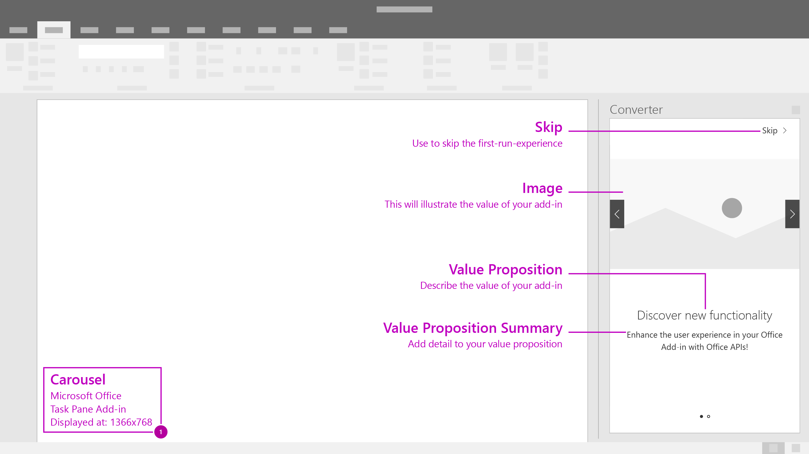
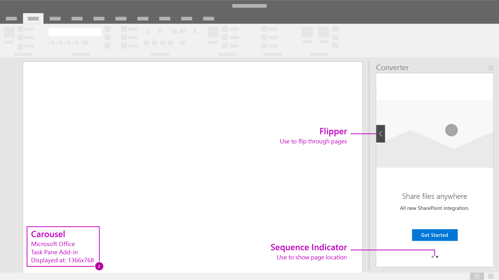

# Carousel

Carousel takes users through a series of features or information pages before they start using the add-in.

> Formally named **Paging Panel**.

#### Code sample
* [Carousel code sample](https://github.com/OfficeDev/Office-Add-in-UX-Design-Patterns-Code/tree/master/templates/first-run/carousel)

***

Recommended flow for when using the carousel. 

1. Allow users to advance or skip the beginning pages of the carousel flow. 

2. Provide a clear call to action to exit the first-run-experience.
