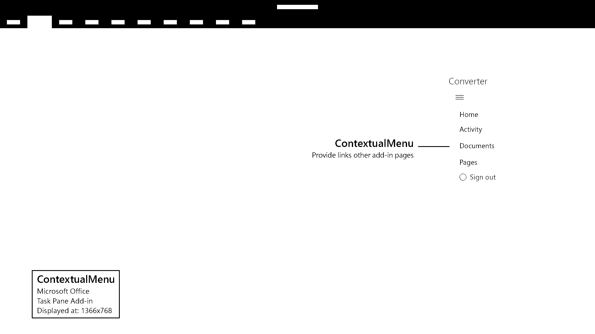

# Contextual Menu

A menu originating from a command bar, a cursor or focus. This helps users remember command locations, or find less used commands based on proximity to others. 

#### Code sample
* [Contextual menu code sample](https://github.com/OfficeDev/Office-Add-in-UX-Design-Patterns-Code/tree/master/templates/navigation/navigation)

***

Callouts for desktop task pane 

