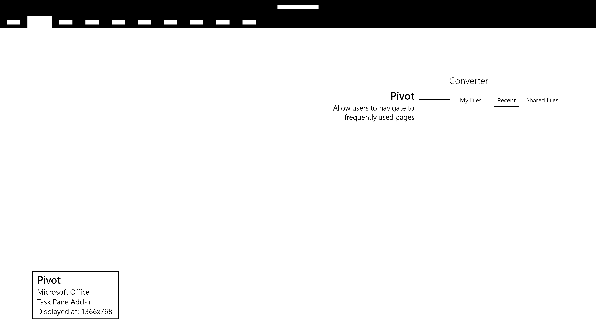

# Pivot

Shows Pivot navigation inside of a task pane. Use pivot navigation to allow users to navigate between different content. 

#### Code sample
* [Pivot code sample](https://github.com/OfficeDev/Office-Add-in-UX-Design-Patterns-Code/tree/master/templates/navigation/pivot)

***

Specifications for desktop task pane
