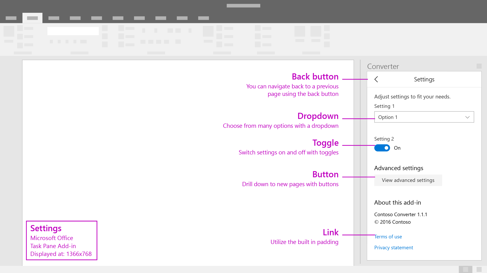

# Settings

Settings displays common components that may be used within an Add-in's settings menu.

#### Code sample
* [Settings code sample](https://github.com/OfficeDev/Office-Add-in-UX-Design-Patterns-Code/tree/master/templates/utility/settings)

***

Specifications for desktop task pane 

