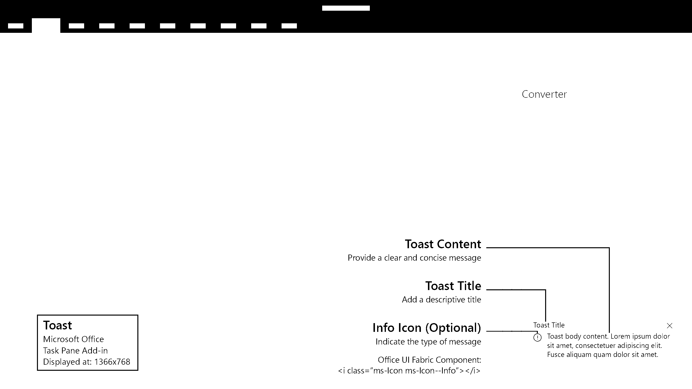

# Toast

Toast provides a brief message that fades away after a few seconds. Since the user might not see the message, use toast only for inessential information. It is a good choice for notifying users of an event in a remote system, such as the receipt of an email.

#### Code sample
* [Toast code sample](https://github.com/OfficeDev/Office-Add-in-UX-Design-Patterns-Code/tree/master/templates/notifications/toast)

***

Specifications for desktop task pane