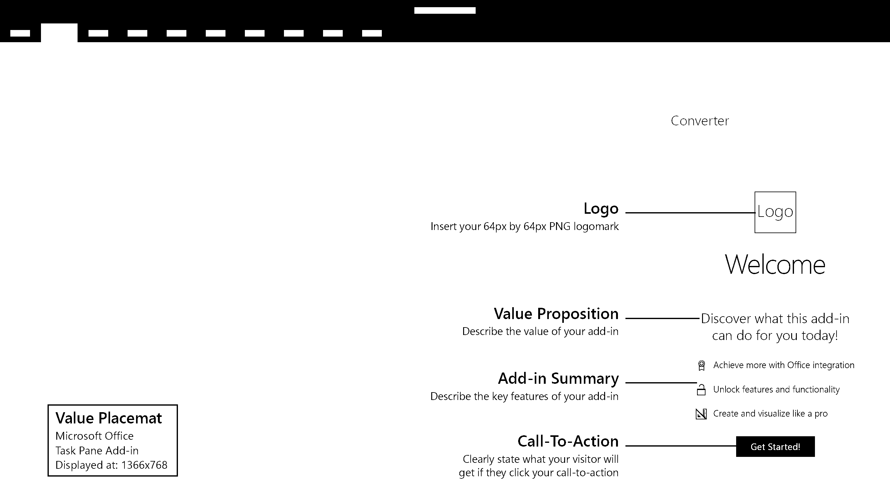

# Value Placemat

Value Placemat communicates your add-in's value proposition.

#### Code sample
* [Value placemat code sample](https://github.com/OfficeDev/Office-Add-in-UX-Design-Patterns-Code/tree/master/templates/first-run/value-placemat)

***

Specifications for desktop task pane 
